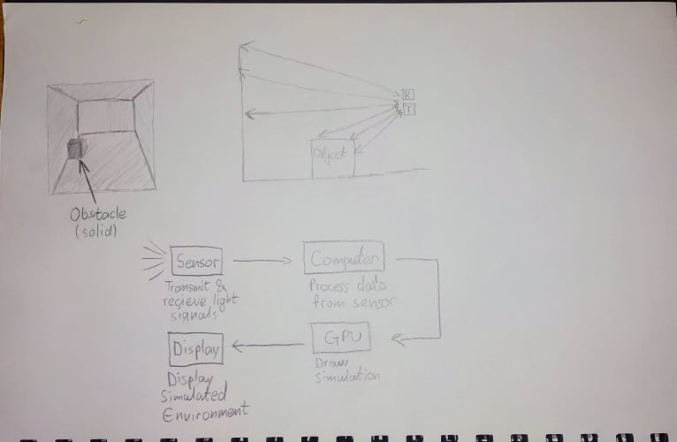

## IM Capstone prototype 1 & 2 documentation

While I was initially creating my capstone project idea, I began thinking about ways in which I could create a visual representation of what I want to accomplish. However, prototyping is one of the most difficult parts of the realization of my project, since during this process, the learning curve is also the steepest. Due to this, my first and second prototypes are just simple diagrams which I hope will give both me and my mentors a clear idea of what my goal is, and from that determine which parts of the project I should focus on, and which parts, if any, I should drop. During the second seminar class, I had the opportunity to discuss my progress with my peers as well as learn from their project concepts and ideas. It was also extremely helpful to see past IM capstone projects, because it made me realize how many different ways of creating the project there are. One of those projects helped me understand that my design does not have to be as “closed” as I imagined it to be, meaning that instead of having one single device that realizes the goal, it is possible to design a system of multiple devices communicating with each other to accomplish the same goal. This approach will allow me to isolate parts of the entire project, which will greatly ease troubleshooting during the trial and error process resulting in a higher possibility of success. After this, if there are no errors, I will be able to make my project more compact and realize my initial idea. My current task for this project is to keep working on an elaborate design and prototype using CAD software. I will constantly be updating the latest versions of the prototype, until I determine that the design is complete and ready to be fabricated.

