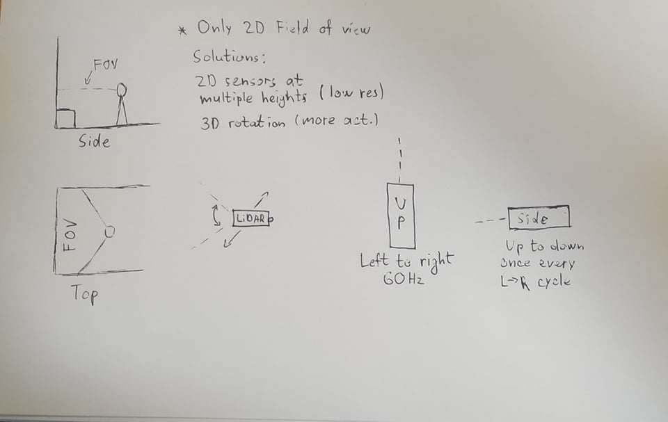
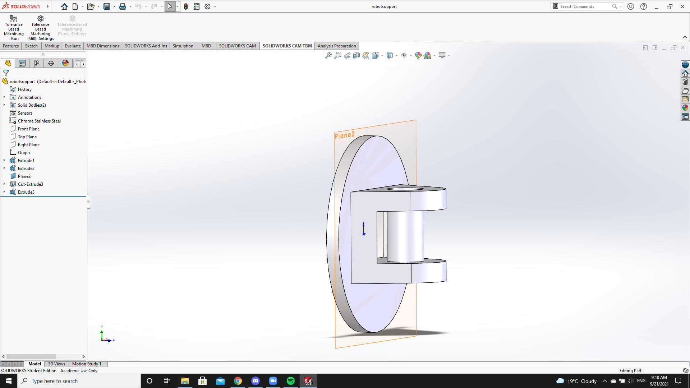

## Resolution issue and Solidworks start

In the image below I am brainstorming simple ways to make a 2D LiDAR scanner scan in 3D as well as predicting which problems could come up from the ideas.

### Part for representation

