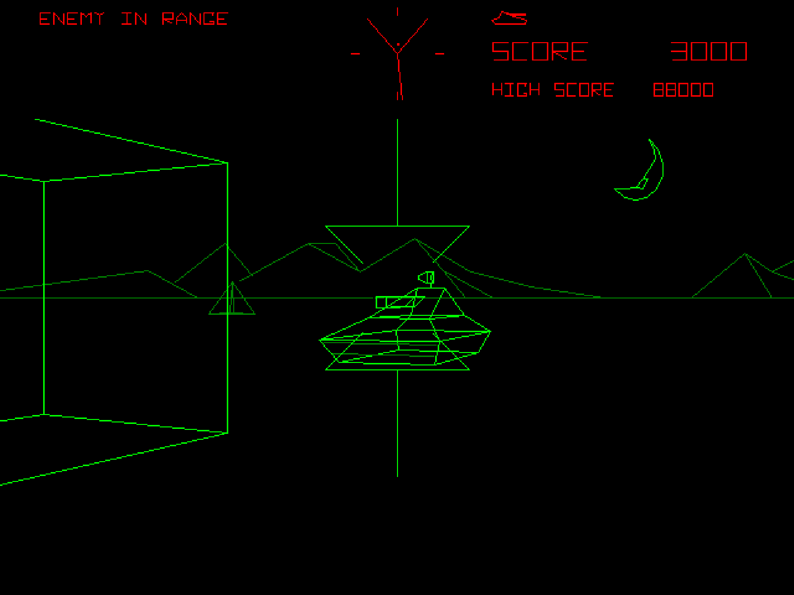

# Concept development:

Throughout the week I met with my capstone advisor to check in on my project idea development. In the meeting, my advisor assisted me with developing the concept further.
The main topic of discussion was the user's experience. We discussed ways in which I could present what the user of the technology is supposed to see and feel while using the device.
Another topic of discussion how to visualize the data from the sensors with highest details and lowest need for processing power.

I am currently working on image editing, to create images that will accurately represent a user's point of view in a closed environment. The form of visual representation was inspired 
by a video game from the 1980, Battlezone Atari, as shown in the picture:

