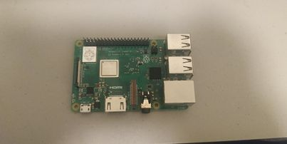

# Weekly Progress February 23 2022

Throughout the past week I was developing and thinking about the theoretical concept of my capstone project. I am extremely worried that the most neccessary parts will not be available 
before spring break and that I would be forced to present a more conceptual piece of work. I got the idea to make the robotic vision more interactive and to allow the users to give and read
commands to the lidar scanner (similary to how a camera with machine learning software works). However, today I discussed my project with my major mentor Professor Michael Shiloh and he offered
to lend me a RaspberryPi microcomputer for as long as I need one. This helped me in the way that it relieved my stress of borrowing one for a limited amount of time from the IM lab. Unfortunately, the 
professor did not have the necessary cables that are needed to connect the device to my laptop, so I will be renting the cables from the IM lab in the next few days. Regarding the conceptual idea
I came to the conclusion that although it needs slightly more development. I should focus on what I am currently planning to create and not start larger projects that would overshadow my current idea and project.

